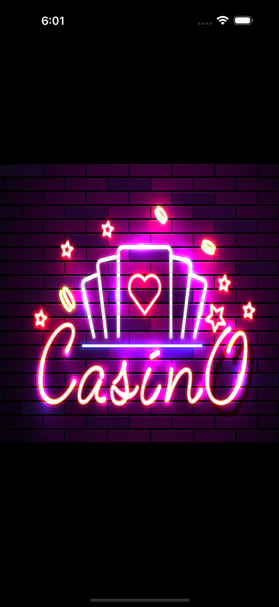
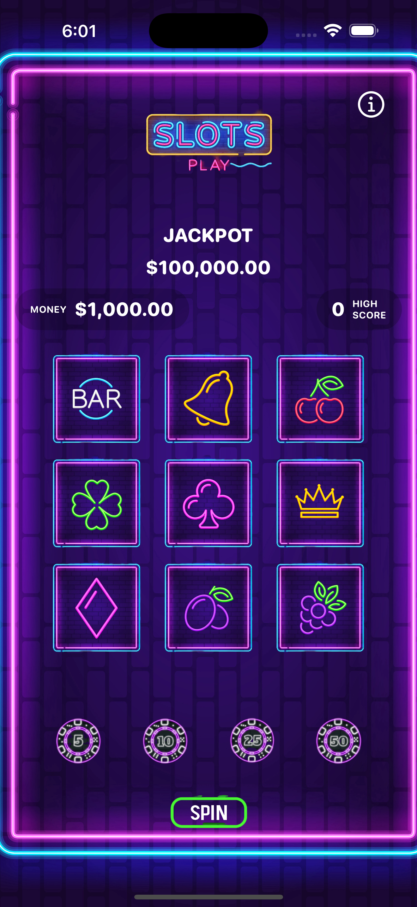
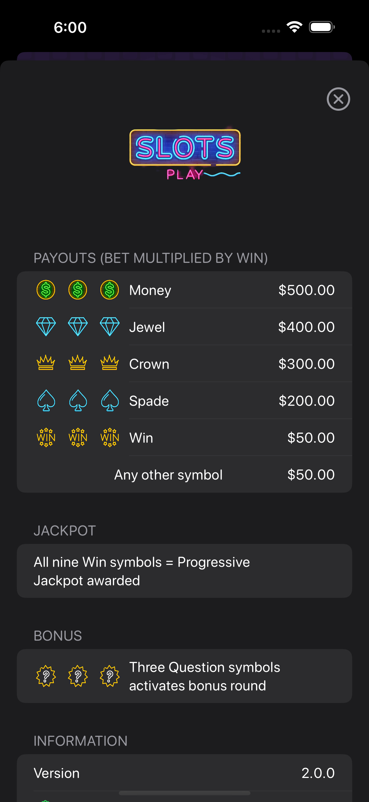
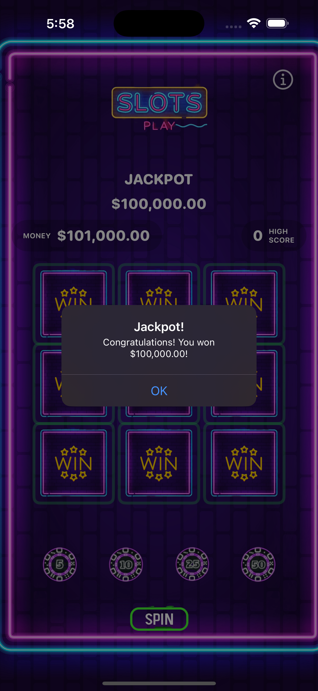
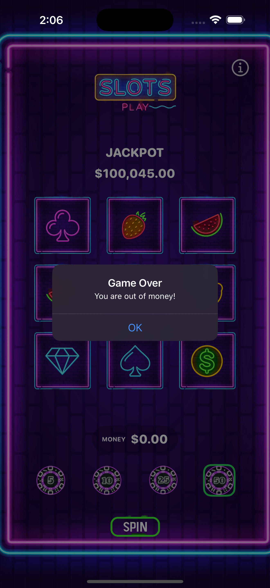

# Neon Casino

##

Neon Casino is a modern, SwiftUI-based slot machine game with a progressive jackpot, crisp neon visuals, and a focus on testability.

## Gameplay overview
- Progressive jackpot: Starts at $100,000 and increases by 10% of your bet on each non-jackpot spin. When won, it resets to $100,000.
- Wins: Three-in-a-row (rows, columns, diagonals) pay based on symbol:
  - Money: $500
  - Jewel: $400
  - Crown: $300
  - Spade: $200
  - Win: $50
  - Any other symbol: $50
- Jackpot: All nine reels show the Win symbol. The full jackpot amount is added to your current money.
- Visual feedback: Winning lines flash and alert displays payouts.

## Features
- SwiftUI + MVVM: `SlotMachineView` renders from `GameViewModel` (`ObservableObject`), which encapsulates rules, state, and persistence.
- Rules engine: `GameRules` is a pure evaluator for deterministic unit tests.
- Persistence: `UserDefaults` stores jackpot, bet, and high score.
- Sound + haptics: Simple `AVAudioPlayer` wrapper and notification haptics.
- Deterministic UI testing: Launch with `UITEST_FORCE` to force outcomes (e.g., `jackpot`, `loss`, `win_horizontal`, `win_vertical`, diagonals).

## Building
- Xcode 15+, iOS 16+ recommended
- Open `Neon-Casino.xcodeproj` and run the `Neon-Casino` scheme

## Images

Here are some screenshots of Authenticator+ in action:

  
  
  
  
  

## License
Neon Casino is available under the MIT license. See the `LICENSE.md` file for more info.

## Acknowledgements
 
